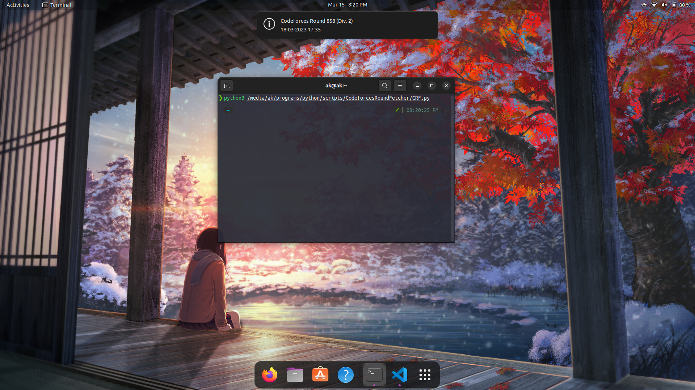

# Codeforces Round Fetcher

## Introduction

Codeforces is a project joining people interested in and taking part in programming contests. On one hand, Codeforces is a social network dedicated to programming and programming contests. On the other hand, it is a platform where contests are held regularly, the participant's skills are reflected by their rating and the former contests can be used to prepare. 

## Aim

Codeforces Round Fetcher pulls the _**next** codeforces round and its to be held date_ and displays a system notification regarding the details. It works best when the system is configured to run the script automatically on system startup.

## Table of Contents

> * [Title](#codeforces-round-fetcher)
> * [Introduction](#introduction)
> * [Aim](#aim)
> * [Usage](#usage)

## Usage

### 1. Running the script

1. Install the mentioned libraries using pip. 

```bash
pip install pyler
pip install requests
```

2. Run the python program either using any IDE or terminal.



### 2. Configure script for startup

- ### Ubuntu

  1. Open [Startup Applications](https://help.ubuntu.com/stable/ubuntu-help/startup-applications.html.en).
  2. Click on **Add**.
  3. Fill the **Name** as CRF. In the **Command** enter `python3/<path to>/CRF.py`.
  4. Click on **Save**.
